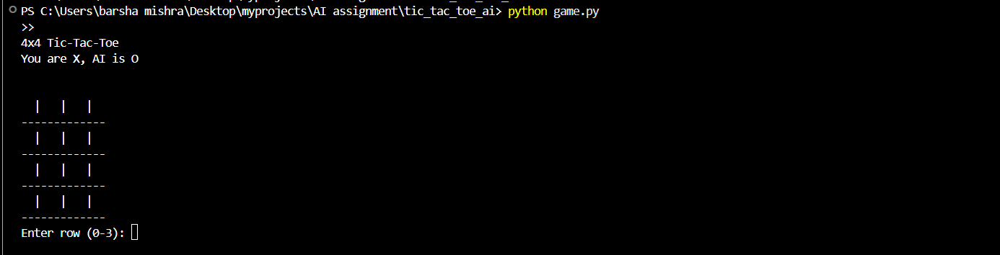
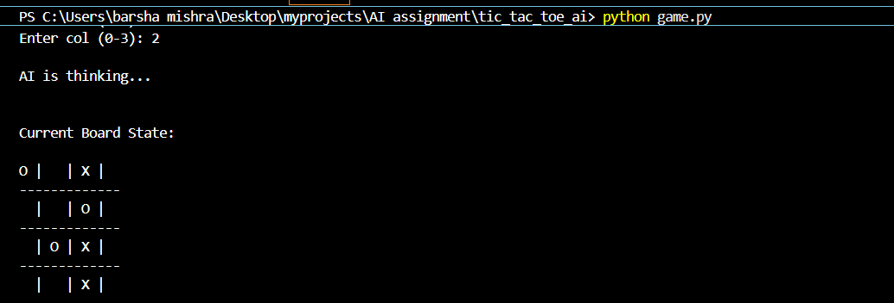
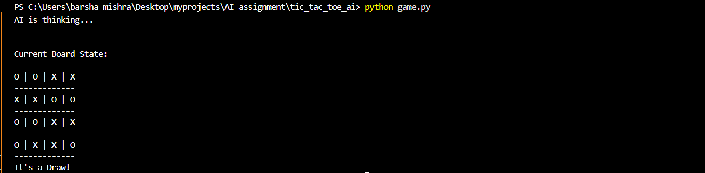

# 4x4 Tic-Tac-Toe with Minimax and Alpha-Beta Pruning

## Project Overview

This project implements an intelligent agent to play Tic-Tac-Toe on a 4x4 grid. Unlike the standard 3x3 game, the 4x4 version significantly increases the number of possible board states, necessitating the use of optimized search algorithms. The AI uses the Minimax algorithm enhanced with Alpha-Beta Pruning and a heuristic evaluation function, enabling efficient decision-making within a limited search depth.

## System Components

### 1. `board.py`

Handles the game logic and board representation.

* **Board Representation:** A 4x4 nested list initialized with empty strings.
* **Win Evaluation (`evaluate`):** Checks rows, columns, and diagonals for four consecutive marks. Returns `+10` for an AI win and `-10` for a Human win.
* **Heuristic Function (`heuristic`):** Evaluates non-terminal board states. Scores are assigned based on potential lines that can lead to a win, allowing the AI to make strategic decisions without exploring the entire game tree.

### 2. `minimax.py`

Implements the AI’s decision-making engine.

* **Minimax Algorithm:** Recursive function simulating all possible moves. The AI maximizes the score while assuming the human plays optimally to minimize it.
* **Alpha-Beta Pruning:** Reduces nodes evaluated by pruning branches that cannot influence the final decision, improving performance.
* **Depth Limiting:** The search depth is set to 3 to ensure timely AI responses, as a full search of a 4x4 board is computationally expensive.

### 3. `game.py`

Main entry point for the application.

* **Game Loop:** Manages turns between the human player and the AI.
* **Input Validation:** Ensures coordinates are within the 0-3 range and prevents moves to occupied cells.
* **Terminal Interface:** Provides a clear, text-based visualization of the board after each move.

## Technical Specifications

* **Grid Size:** 4x4
* **Win Condition:** 4 in a row (horizontal, vertical, or diagonal)
* **Algorithm:** Minimax with Alpha-Beta Pruning
* **Search Depth:** 3 levels
* **Programming Language:** Python 3.x

## How to Run

1. Ensure Python 3.x is installed.
2. Place `board.py`, `minimax.py`, and `game.py` in the same folder.
3. Run the game using the terminal command:

   ```bash
   python game.py
   ```
4. Enter row and column indices (0, 1, 2, or 3) as prompted.

## Screenshots

### Initial Empty Board


### AI Responding


### Game Conclusion (Win/Draw)



## Author Information

* **Name:** Barsha Mishra
* **College / University:** Sister Nivedita University
* **Department:** Computer Science and Engineering
* **Course / Semester:** B.Tech, 2nd Year, Semester 4

## Submission Details

* **Course Name:** Artificial Intelligence Lab
* **Project Title:** 4x4 Tic-Tac-Toe with Minimax and Alpha-Beta Pruning

## Conclusion

This project illustrates the application of adversarial search in game theory. By combining Minimax with Alpha-Beta Pruning and a heuristic evaluation function, the AI efficiently handles the larger 4x4 board, providing competitive gameplay while managing computational complexity.

---

